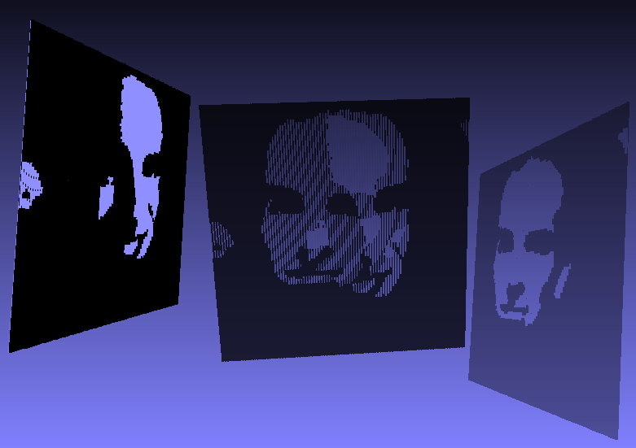

# ridge-o-gram

Produces "lenticular" models from black and white image pairs. The pixels of
each image are presented as the left and right faces of a series of ridges,
so that one image is seen when you view the object from the left and the other
from the right. Intended to take advantage of the Makerbot 2x’s dual extruders
by printing the "black" and "white" portions as interlocking perforated layers. 

# Usage

Here is the output of `rog -h`:

	Usage: rog [OPTIONS] LEFT RIGHT OUTPUT
	
	The LEFT and RIGHT arguments specify the paths to the input images, which
	must have the same dimensions. Grayscale images will be interpreted as black
	and white according to the -t option. Color images will be read as grayscale
	images according to an intermediate luminance conversion (0.3R 0.59G 0.11B).
	Supported image formats include PNG, GIF, and [non-progressive] JPG.
	
	The OUTPUT argument specifies the base output path; output will consist of
	two STL files, named OUTPUT-white.stl and OUTPUT-black.stl.
	
	OPTIONS (DEFAULT):
	
	-a THICKNESS (0.25) Bottom layer (white base) thickness.
	-b THICKNESS (0.25) Middle layer (black base) thickness. 
	-c THICKNESS (0.5)  Top layer (image ridges) thickness.
	-s SCALE     (1.0)  Scaling factor applied to x/y coordinates.
	-t THRESHOLD (155)  Brightness values > THRESHOLD considered white.
	-f           (off)  Output ASCII format STL instead of binary.
	-o           (off)  Locate origin at bottom left of image instead of center.
	-h           (off)  Display this help message and quit.

# Examples

The `examples` folder contains two test cases, `tiny` and `face`.
The STL files were produced with the default options. For example:

	./rog examples/face-left.jpg examples/face-right.jpg examples/face

The above command produces `examples/face-white.stl` and `examples/face-black.stl`,
which together form the ridged surface displayed from different angles in this
composite image:

# Acknowledgements

Images are loaded using Sean Barrett's public domain [stb_image.c](http://nothings.org/stb_image.c) library.

# License

Ridge-o-gram is freely distributed under an open source MIT License. See the `LICENSE` file for details.
